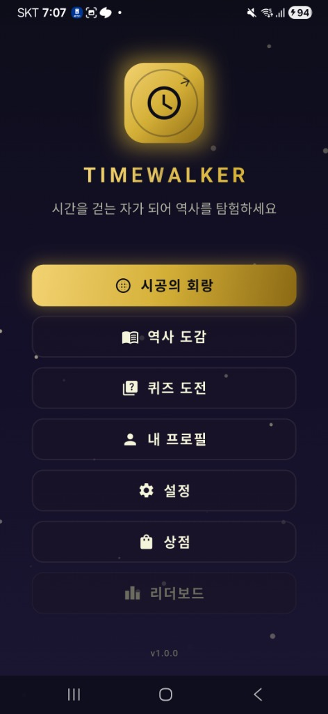
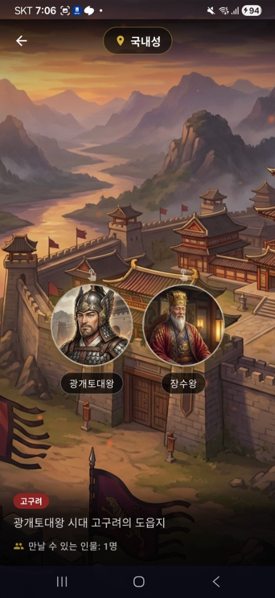
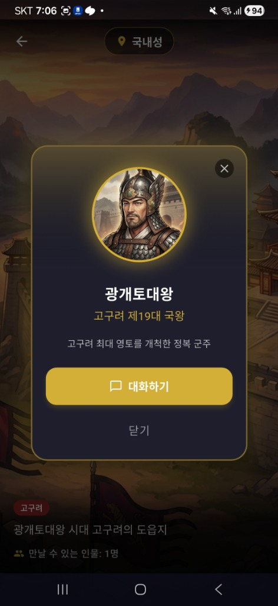

<div align="center">

# ⏳ TimeWalker: Echoes of the Past

**전 세계의 역사를 시간 여행과 지도 탐험으로 배우는 인터랙티브 교육 어드벤처 게임**

[](https://flutter.dev)
[](https://dart.dev)
[]()

</div>

---

## 📖 목차

- [프로젝트 소개](#-프로젝트-소개)
- [주요 기능](#-주요-기능)
- [기술 스택](#-기술-스택)
- [프로젝트 구조](#-프로젝트-구조)
- [설치 및 실행](#-설치-및-실행)
- [개발자 가이드](#-개발자-가이드)
- [최근 업데이트](#-최근-업데이트)
- [라이선스](#-라이선스)

---

## 🎮 프로젝트 소개

**TimeWalker: Echoes of the Past**는 플레이어가 '타임 워커'가 되어 다양한 시대와 장소를 여행하며 역사적 사건을 체험하고, 역사 인물들과 대화하며 숨겨진 이야기를 발견하는 교육용 게임입니다.

### 🎯 핵심 가치

| 가치 | 설명 |
|------|------|
| 🏛️ **역사적 정확성** | 실제 역사를 기반으로 한 콘텐츠 |
| 🎓 **교육적 재미** | 퀴즈, 백과사전, 대화를 통한 자연스러운 학습 |
| 🌏 **글로벌 콘텐츠** | 한국, 중국, 일본, 유럽 등 전 세계 역사 탐험 |
| 🎨 **몰입형 경험** | 고품질 일러스트와 BGM으로 시대 분위기 재현 |

### 📱 앱 스크린샷

<div align="center">

<table>
  <tr>
    <td align="center"><b>메인 메뉴</b></td>
    <td align="center"><b>장소 탐험</b></td>
    <td align="center"><b>캐릭터 정보</b></td>
  </tr>
  <tr>
    <td></td>
    <td></td>
    <td></td>
  </tr>
  <tr>
    <td align="center"><b>대화 장면</b></td>
    <td align="center"><b>대화 선택지</b></td>
    <td></td>
  </tr>
  <tr>
    <td></td>
    <td></td>
    <td></td>
  </tr>
</table>

</div>

---

## ✨ 주요 기능

### 🗺️ 인터랙티브 지도 탐험
- Flame 엔진 기반의 월드맵 시스템
- 실제 좌표 투영을 통한 지리적 정확성
- 시대별/지역별 탐험 가능 지역 동적 관리

### ⏰ 시대 여행 (Time Travel)
- **삼국시대** (고구려, 백제, 신라, 가야)
- **남북국시대** (통일신라, 발해)
- **고려시대** (918-1392)
- **조선시대** (1392-1897)
- **대한민국 근현대사** (1897-현재)
- **르네상스** (14-17세기 유럽)
- *그 외 다양한 시대 지속 추가 중...*

### 💬 대화 시스템
- JSON 기반 대화 스크립트
- 역사적 인물과의 상호작용
- 선택지에 따른 분기 스토리

### 📚 교육 콘텐츠
- **백과사전**: 역사적 사건, 인물, 문화 정보
- **퀴즈**: 학습 내용 확인 및 보상 시스템
- **장소 탐험**: 역사적 장소의 시각적 체험

### 🏆 진행 시스템
- 업적 달성 및 보상
- 시대/국가 해금 시스템
- 인벤토리 및 상점

### 🌐 다국어 지원
- 한국어 / English

---

## 🛠 기술 스택

### Core
| 기술 | 버전 | 용도 |
|------|------|------|
| **Flutter** | 3.10.1 | 크로스플랫폼 프레임워크 |
| **Dart** | 3.10.1 | 프로그래밍 언어 |

### State Management & Architecture
| 기술 | 버전 | 용도 |
|------|------|------|
| **Flutter Riverpod** | 2.6.1 | 상태 관리 |
| **Go Router** | 15.1.2 | 라우팅 |

### Game & Media
| 기술 | 버전 | 용도 |
|------|------|------|
| **Flame** | 1.27.0 | 게임 엔진 (지도, 애니메이션) |
| **Flame Audio** | 2.10.5 | BGM/SFX 재생 |

### Storage & Backend
| 기술 | 버전 | 용도 |
|------|------|------|
| **Hive** | 2.2.3 | 로컬 데이터 저장 |
| **Supabase Flutter** | 2.6.0 | 원격 데이터 동기화 |

### UI & Animation
| 기술 | 버전 | 용도 |
|------|------|------|
| **Flutter SVG** | 2.0.9 | SVG 렌더링 |
| **Shimmer** | 3.0.0 | 로딩 효과 |
| **Simple Animations** | 5.2.0 | UI 애니메이션 |

---

## 📂 프로젝트 구조

```
time_walker/
├── 📁 lib/                          # 소스 코드
│   ├── 📄 main.dart                 # 앱 진입점
│   │
│   ├── 📁 core/                     # 핵심 유틸리티
│   │   ├── config/                  # 앱 설정 (Supabase 등)
│   │   ├── constants/               # 상수 정의
│   │   ├── errors/                  # 에러 처리 (Result 패턴)
│   │   ├── routes/                  # GoRouter 라우팅
│   │   ├── services/                # 핵심 서비스 (Audio 등)
│   │   ├── themes/                  # 테마 및 디자인 시스템
│   │   └── utils/                   # 유틸리티 함수
│   │
│   ├── 📁 domain/                   # 도메인 레이어
│   │   ├── entities/                # 비즈니스 엔티티
│   │   │   ├── achievement.dart     # 업적
│   │   │   ├── character.dart       # 캐릭터
│   │   │   ├── country.dart         # 국가
│   │   │   ├── era.dart             # 시대
│   │   │   ├── location.dart        # 장소
│   │   │   ├── quiz.dart            # 퀴즈
│   │   │   └── user_progress.dart   # 유저 진행도
│   │   ├── repositories/            # 리포지토리 인터페이스
│   │   ├── services/                # 도메인 서비스
│   │   │   ├── achievement_service.dart
│   │   │   ├── country_unlock_rules.dart
│   │   │   └── progression_service.dart
│   │   └── usecases/                # 유스케이스
│   │
│   ├── 📁 data/                     # 데이터 레이어
│   │   ├── datasources/             # 데이터 소스
│   │   │   ├── local/               # 로컬 (Hive)
│   │   │   ├── static/              # 정적 데이터
│   │   │   └── remote/              # 원격 (Supabase)
│   │   ├── models/                  # 데이터 모델
│   │   ├── repositories/            # 리포지토리 구현체
│   │   └── seeds/                   # 초기 데이터
│   │
│   ├── 📁 presentation/             # 프레젠테이션 레이어
│   │   ├── providers/               # Riverpod 프로바이더
│   │   ├── screens/                 # 화면
│   │   │   ├── main_menu/           # 메인 메뉴
│   │   │   ├── time_portal/         # 시대 선택
│   │   │   ├── era_exploration/     # 시대 탐험
│   │   │   ├── dialogue/            # 대화
│   │   │   ├── encyclopedia/        # 백과사전
│   │   │   ├── quiz/                # 퀴즈
│   │   │   ├── shop/                # 상점
│   │   │   ├── inventory/           # 인벤토리
│   │   │   ├── achievement/         # 업적
│   │   │   ├── profile/             # 프로필
│   │   │   ├── settings/            # 설정
│   │   │   └── ...                  # 기타 화면
│   │   └── widgets/                 # 재사용 위젯
│   │       └── common/              # 공통 위젯
│   │
│   ├── 📁 game/                     # Flame 게임 엔진
│   │   └── world_map/               # 월드맵 게임
│   │
│   └── 📁 l10n/                     # 다국어 지원
│       ├── app_ko.arb               # 한국어
│       └── app_en.arb               # 영어
│
├── 📁 assets/                       # 에셋
│   ├── audio/                       # 오디오 (BGM, SFX)
│   ├── data/                        # JSON 데이터
│   │   ├── characters.json          # 캐릭터 정보
│   │   ├── locations.json           # 장소 정보
│   │   ├── dialogues.json           # 대화 스크립트
│   │   ├── encyclopedia.json        # 백과사전
│   │   └── quizzes.json             # 퀴즈
│   ├── icons/                       # 아이콘
│   └── images/                      # 이미지
│       ├── characters/              # 캐릭터 일러스트
│       ├── locations/               # 장소 배경
│       ├── encyclopedia/            # 백과사전 이미지
│       └── ui/                      # UI 요소
│
├── 📁 test/                         # 테스트
│   ├── fixtures/                    # Mock 데이터
│   ├── helpers/                     # 테스트 유틸리티
│   ├── mocks/                       # Mock 객체
│   ├── unit/                        # 유닛 테스트
│   ├── widget/                      # 위젯 테스트
│   └── integration/                 # 통합 테스트
│
├── 📁 docs/                         # 문서
│   ├── plans/                       # 개발 계획
│   ├── TimeWalker_PRD.md            # 제품 요구사항
│   └── ...                          # 기타 문서
│
└── 📁 tools/                        # 유틸리티 스크립트
```

---

## 🚀 설치 및 실행

### 사전 요구사항
- Flutter SDK 3.10.1 이상
- Dart SDK 3.10.1 이상
- Android Studio 또는 VS Code
- Git

### 설치

```bash
# 1. 저장소 클론
git clone https://github.com/kaywalker91/TimeWalker.git
cd TimeWalker

# 2. 의존성 설치
flutter pub get

# 3. 코드 생성 (Hive 어댑터 등)
flutter pub run build_runner build --delete-conflicting-outputs

# 4. 앱 실행
flutter run
```

### 플랫폼별 실행

```bash
# Android
flutter run -d android

# iOS
flutter run -d ios

# Web
flutter run -d chrome

# 디버그 모드로 특정 디바이스 선택
flutter devices  # 디바이스 목록 확인
flutter run -d <device_id>
```

### Supabase 연동 실행 (선택사항)

Supabase 백엔드와 연동하려면 환경변수를 설정합니다:

```bash
# Supabase와 연동하여 실행
flutter run \
  --dart-define=SUPABASE_URL=https://your-project.supabase.co \
  --dart-define=SUPABASE_ANON_KEY=your-anon-key

# 또는 .env 파일 설정 후 마이그레이션 스크립트 실행
cp .env.example .env
# .env 파일에 Supabase 키 입력

# 데이터 마이그레이션 (선택)
pip install -r tools/supabase/requirements.txt
python tools/supabase/migrate_data.py
```

> **참고**: Supabase 설정 없이 실행하면 앱은 자동으로 로컬 JSON 데이터를 사용합니다.

---

## 👨‍💻 개발자 가이드

### 아키텍처 개요

TimeWalker는 **Clean Architecture** 패턴을 따릅니다:

```
┌─────────────────────────────────────────────────────────────────┐
│                     🎨 Presentation Layer                        │
│     Screens, Widgets, Providers (UI 및 Riverpod 상태 관리)       │
├─────────────────────────────────────────────────────────────────┤
│                     🏛️ Domain Layer                              │
│     Entities, Services, Repository Interfaces (비즈니스 로직)    │
├─────────────────────────────────────────────────────────────────┤
│                     💾 Data Layer                                │
│     Repository Impls, DataSources, Models (데이터 접근)          │
└─────────────────────────────────────────────────────────────────┘
```

### 핵심 컴포넌트

| 컴포넌트 | 경로 | 역할 |
|---------|------|------|
| **Entities** | `lib/domain/entities/` | 비즈니스 객체 (Era, Character, Quiz 등) |
| **Services** | `lib/domain/services/` | 비즈니스 로직 (ProgressionService, AchievementService) |
| **Repositories** | `lib/domain/repositories/` | 데이터 접근 추상화 |
| **Providers** | `lib/presentation/providers/` | Riverpod 상태 관리 |
| **Screens** | `lib/presentation/screens/` | UI 화면 |

### 에러 핸들링

앱 전체에서 일관된 에러 처리를 위해 `Result` 패턴을 사용합니다:

```dart
import 'package:time_walker/core/errors/errors.dart';

// Repository에서 Result 반환
Future<Result<UserProgress>> getUserProgress() async {
  return runCatching(() async {
    final data = await dataSource.fetch();
    return UserProgress.fromJson(data);
  });
}

// UI에서 Result 처리
final result = await getUserProgress();
result.when(
  success: (progress) => showProgress(progress),
  failure: (error) => showError(error.message),
);
```

**예외 클래스 계층:**
- `NetworkException` - 네트워크/API 오류
- `DataException` - 데이터 파싱/저장 오류
- `GameLogicException` - 게임 규칙 위반
- `AuthException` - 인증/권한 오류
- `ValidationException` - 입력값 검증 오류

### 테스트 실행

```bash
# 전체 테스트 실행
flutter test

# 유닛 테스트만 실행
flutter test test/unit/

# 특정 파일 테스트
flutter test test/unit/domain/entities/era_test.dart

# 커버리지 리포트 생성
flutter test --coverage
genhtml coverage/lcov.info -o coverage/html
```

### 코드 컨벤션

| 대상 | 규칙 | 예시 |
|------|------|------|
| 파일명 | `snake_case` | `user_progress.dart` |
| 클래스 | `PascalCase` | `UserProgress` |
| 변수/함수 | `camelCase` | `getUserProgress()` |
| 상수 | `camelCase` | `defaultTimeout` |

### 정적 분석

```bash
# 분석 실행
flutter analyze

# 자동 수정 가능한 이슈 수정
dart fix --apply

# 코드 포매팅
dart format lib/
```

### Admin Mode (개발자 모드)

개발 및 테스트를 위해 모든 콘텐츠를 해금할 수 있습니다:

**설정 > 개발자 > Admin Mode**

> `UserProgressSeed.debugAllUnlocked`를 사용하여 모든 Era, Country, Character를 해금합니다.

---

## 📝 최근 업데이트

### 🆕 2026-01-26 (최신)

#### 🏆 업적/진행 시스템 확장
- Achievement 리포지토리/서비스/유스케이스 정비 및 신규 업적 데이터 추가
- 기본 진행도 팩토리 도입으로 초기 해금/보상 흐름 정리
- 해금 규칙 및 관련 테스트 보강

#### 💬 콘텐츠 & 대화 강화
- 대화 데이터 대규모 확장 및 대화 선택지 UI 추가
- 캐릭터/장소/백과사전 데이터 갱신
- 르네상스 캐릭터 이미지 추가

#### 🎨 UI/테마 개선
- 시대 포털/탐험 패널/배경 연출 개선
- 시대 테마 레지스트리 및 색상/좌표 유틸 정비
- 이미지 캐시 서비스 추가로 로딩 최적화

#### 🧰 개발자 문서 정비
- `.claude/` 규칙과 `.agent/skills` 가이드 추가

### 2026-01-15

#### ☁️ Supabase 백엔드 통합 완료

**Phase 1-3 마이그레이션 완료**
- 📊 **데이터 마이그레이션**: 449개 항목 Supabase로 이전
  - Characters: 62개
  - Dialogues: 64개  
  - Locations: 59개
  - Encyclopedia: 194개
  - Quizzes: 70개
- 🔧 **마이그레이션 도구**: `tools/supabase/` 디렉토리에 스크립트 추가
  - `migrate_data.py`: JSON → Supabase 마이그레이션
  - `validate_data.py`: 데이터 무결성 검증
  - `schema.sql`: 데이터베이스 스키마
  - `load.sql`: 데이터 로드 SQL
- 🏗️ **하이브리드 아키텍처**: Supabase + 로컬 JSON Fallback
  - 환경변수 설정 시 Supabase 사용
  - 미설정 시 로컬 JSON 자동 사용
- 💾 **오프라인 캐싱**: Hive 기반 콘텐츠 캐시 시스템

#### 🌍 역사 콘텐츠 대규모 확장

**Phase 1 - 남북국시대 (698-936)**
- 시대 명칭 '통일신라' → '남북국시대'로 역사적 정확성 개선
- 신라: 석굴암, 불국사, 안압지, 청해진, 장보고, 최치원
- 발해: 상경성, 대조영, 대무예

**Phase 2 - 근현대사 (1897-1950)**
- 대한제국: 덕수궁, 탑골공원, 하얼빈역
- 독립운동: 안창호, 김구, 여운형

**Phase 3 - 고려시대 (918-1392)**
- 만월대, 개경시장, 강화도, 해인사, 팔만대장경

**Phase 4 - 르네상스 (14-17세기)**
- 이탈리아: 피렌체, 로마 바티칸, 베네치아
- 유럽: 마인츠(구텐베르크), 런던 글로브극장
- 인물: 레오나르도 다빈치, 미켈란젤로, 갈릴레오, 셰익스피어

#### 🖼️ 에셋 대량 추가
- 40+ 신규 이미지 (캐릭터, 장소, 백과사전)
- 왕국 아이콘: 고구려(삼족오), 백제(연꽃), 신라(금관), 가야(검)

#### 🔧 품질 개선
- Supabase 통합 기반 구축
- Entity/Service 단위 테스트 확장
- 삼국시대 UI 리디자인

<details>
<summary><b>📅 이전 업데이트 기록</b></summary>

### 2026-01-12

- **엔티티 유닛 테스트 구현**: `UserProfile`, `ExplorationState`, `UserProgress` 테스트
- **Card 위젯 리팩토링**: `TimeCardMixin`, `ThemedCardMixin` 적용
- **Repository Mock 테스트 강화**

### 2026-01-05

- **UserProgress 시드 정비**: 해금 기준 `UserProgressSeed.initial`로 통일
- **국가 해금 규칙 개선**: 해금 조건 안내 문구 추가
- **접근성 강화**: 주요 위젯에 Semantics 적용

### 2025-12-31

- **UI/UX 전면 리팩토링**: 메인 메뉴, 백과사전, 퀴즈, 상점 디자인 개선
- **콘텐츠 확장**: 안중근, 허준, 장영실, 정조 등 캐릭터 추가
- **업적 시스템 구현**: `AchievementService`

### 2025-12-23

- **오디오 시스템 구축**: `AudioService`, BGM/SFX 관리
- **가야 연맹 콘텐츠**: 김수로왕, 허황옥, 우륵
- **Flame 월드맵 개선**: 좌표 투영 시스템

</details>

---

## 🚧 프로덕션 배포 전 필요 작업

배포 전 다음 항목들을 확인하고 교체해야 합니다:

### 콘텐츠 에셋
| 항목 | 현재 상태 | 위치 | 필요 작업 |
|------|----------|------|----------|
| 현대/미래 시대 캐릭터 이미지 | placeholder.png 사용 | `assets/images/characters/contemporary/`, `future/` | 실제 이미지로 교체 |
| 유럽 지역 콘텐츠 | placeholder 데이터 | `assets/data/generated/` | 완성 또는 제거 |

### 오디오 에셋
| 항목 | 현재 상태 | 생성 도구 | 필요 작업 |
|------|----------|----------|----------|
| BGM (11개) | 더미 사인파 | `tools/generate_dummy_audio.py` | 라이선스된 음악으로 교체 |
| SFX (8개) | 더미 효과음 | 상동 | 실제 효과음으로 교체 |

### TODO 항목 (선택적)
- 개인정보처리방침/이용약관 화면 구현
- Firebase Crashlytics 연동
- 인증/튜토리얼 화면 구현

---

## 📄 라이선스

이 프로젝트는 개인 교육 목적으로 개발되었습니다.

---

<div align="center">

**Made with ❤️ for History Education**

</div>
