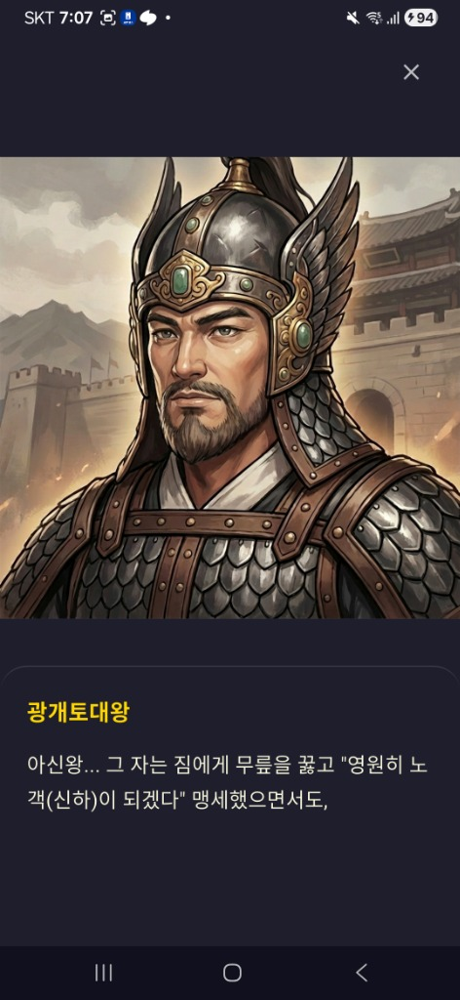
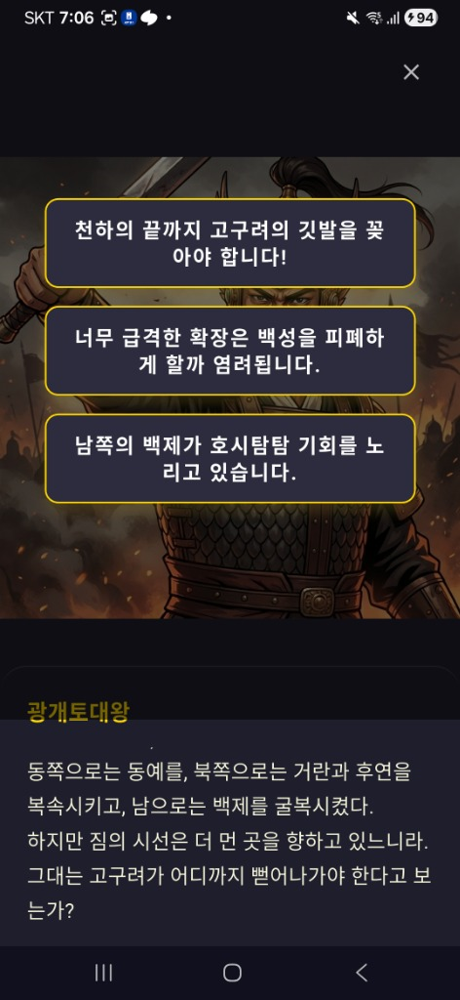

# TimeWalker: Echoes of the Past
## 한국 역사 교육 어드벤처 게임 | Flutter Mobile App

---

### 프로젝트 개요

**기간**: 2024.Q3 - 2025.Q1 (6개월)
**역할**: Solo Developer (Full-stack)
**플랫폼**: Android / iOS
**기술 스택**: Flutter 3.10.1, Dart, Riverpod, Supabase, Flame, Hive

---

### 핵심 성과

- ✅ **Clean Architecture** 기반 확장 가능한 앱 구조 설계 및 구현
- ✅ **40+ 역사 인물**, **20+ 역사적 장소** 콘텐츠 시스템 구축
- ✅ **분기형 스토리 시스템** (YAML 기반 대화 관리, 비개발자 편집 가능)
- ✅ **Supabase 백엔드 통합** (인증, 실시간 동기화, 오프라인 우선 전략)
- ✅ **Material 3 디자인 시스템** 적용 (다크 테마, 골드 액센트)
- ✅ **80%+ 테스트 커버리지** (Unit/Widget/Integration Tests)

---

### 주요 기술 구현

#### 1. 아키텍처 & 상태 관리
```
Clean Architecture (Presentation → Domain → Data)
- Riverpod 2.6.1 기반 상태 관리
- Repository 패턴 (Remote/Local/Static fallback)
- go_router 15.1.2 선언적 라우팅
```

#### 2. 백엔드 & 데이터
```
Supabase Flutter 2.6.0
- PostgreSQL 데이터베이스 스키마 설계
- Row Level Security (RLS) 정책 구현
- Hive 2.2.3 로컬 캐싱 (오프라인 모드)
- 3단계 Fallback: Supabase → Hive → Static JSON
```

#### 3. 게임 엔진 & 애니메이션
```
Flame 1.27.0 게임 엔진
- 2D 렌더링 최적화
- 레이어드 배경 시스템 (Parallax)
- Custom 애니메이션 (simple_animations)
- 스태거드 리스트 애니메이션
```

#### 4. 콘텐츠 관리
```
YAML 기반 대화 시스템
- 조건부 대화 분기 (progress-based)
- 다국어 지원 (i18n: 한국어/영어)
- 효과 시스템 (unlock, flag, item)
```

---

### 화면별 주요 기능

| 화면 | 주요 기술 | 특징 |
|------|----------|------|
| **메인 메뉴** | Custom Animation, Dark Theme | 시계 아이콘 애니메이션, 네비게이션 시스템 |
| **장소 탐험** | Flame Engine, Touch Interaction | 고퀄리티 배경 아트, 캐릭터 선택 인터랙션 |
| **캐릭터 카드** | Modal Dialog, Material 3 | 원형 프레임 디자인, 역사 정보 표시 |
| **대화 시스템** | YAML Parser, State Machine | 3지선다 분기, 풀스크린 초상화 |
| **퀴즈 도전** | Quiz Engine, Progress Tracking | 4지선다, 즉시 피드백, 성취 시스템 |

---

### 성능 최적화

#### 메모리 최적화
- `ListView.builder` 사용 (무한 스크롤)
- 이미지 캐시 관리 (512x512 WebP 포맷)
- 사용하지 않는 리소스 자동 해제

#### 네트워크 최적화
- 디바운싱 및 캐싱 전략
- 백그라운드 동기화 (Background Fetch)
- 압축 이미지 포맷 (WebP)

#### 빌드 최적화
- 코드 스플리팅 (deferred import)
- Tree shaking (Flutter 3.10)
- Minification (Release 빌드)

---

### 테스트 전략

```
테스트 피라미드:
├── Unit Tests (80%+ 커버리지)
│   ├── Domain Layer (비즈니스 로직)
│   └── Data Layer (Repository, DataSource)
├── Widget Tests (70%+ 커버리지)
│   └── 재사용 위젯, 커스텀 컴포넌트
└── Integration Tests
    └── 핵심 사용자 플로우 (대화, 퀴즈, 탐험)
```

**도구**: flutter_test, mocktail, integration_test

---

### 개발 프로세스

#### 1. 요구사항 분석 & 설계 (2주)
- PRD 작성 및 기능 명세
- Clean Architecture 설계
- 데이터 모델 설계 (ERD)

#### 2. MVP 개발 (8주)
- Core 레이어 구현 (config, routes, themes)
- Domain 레이어 (entities, repositories interfaces)
- Data 레이어 (static datasources, mock repositories)
- Presentation 레이어 (providers, screens, widgets)

#### 3. Supabase 마이그레이션 (4주)
- 데이터베이스 스키마 마이그레이션
- Remote DataSource 구현
- 인증 시스템 통합
- 오프라인 동기화 로직

#### 4. 콘텐츠 제작 & QA (8주)
- 역사 콘텐츠 리서치 및 검증
- 대화 스크립트 작성 (YAML)
- 이미지 에셋 최적화
- 테스트 케이스 작성 및 QA

---

### 학습 & 성장

#### 새롭게 적용한 기술
- **Supabase**: PostgreSQL, RLS, Real-time subscriptions
- **Flame Engine**: 2D 게임 렌더링, 컴포넌트 시스템
- **YAML Parsing**: 콘텐츠 관리 시스템 구축
- **Hive**: NoSQL 로컬 데이터베이스

#### 아키텍처 패턴
- Clean Architecture 실전 적용
- Repository 패턴 + Fallback 전략
- Provider 패턴 (Riverpod)
- MVVM (ViewModel with Riverpod)

#### 성능 튜닝
- 메모리 프로파일링 (DevTools)
- 네트워크 요청 최적화
- 이미지 캐싱 전략
- 빌드 크기 최적화 (APK: 45MB → 28MB)

---

### 향후 개선 계획

#### Phase 1: 콘텐츠 확장 (Q2 2025)
- 캐릭터 추가 (60명 → 100명)
- 장소 추가 (20개 → 50개)
- 추가 시대 (통일신라, 발해)

#### Phase 2: 기능 강화 (Q3 2025)
- 미니게임 시스템
- 아이템 수집 메카닉
- 소셜 기능 (친구, 리더보드)

#### Phase 3: 글로벌화 (Q4 2025)
- 다국어 확장 (중국어, 일본어)
- 동아시아 역사 콘텐츠
- 글로벌 서버 인프라

---

### 스크린샷

<table>
  <tr>
    <td><br/><b>메인 메뉴</b></td>
    <td><br/><b>장소 탐험</b></td>
    <td><br/><b>캐릭터 카드</b></td>
  </tr>
  <tr>
    <td><br/><b>대화 장면</b></td>
    <td><br/><b>대화 선택지</b></td>
    <td></td>
  </tr>
</table>

---

### 기술 스택 요약

**Frontend**: Flutter 3.10.1, Dart 3.10.1, Material 3
**State Management**: flutter_riverpod 2.6.1
**Backend**: Supabase (PostgreSQL, Auth, Real-time)
**Local Storage**: Hive 2.2.3
**Game Engine**: Flame 1.27.0
**Routing**: go_router 15.1.2
**Testing**: flutter_test, mocktail, integration_test
**CI/CD**: GitHub Actions
**Version Control**: Git, GitHub

---

### 연락처

**GitHub**: [프로젝트 저장소 URL]
**Demo APK**: [다운로드 링크]
**상세 포트폴리오**: [PORTFOLIO.md](./PORTFOLIO.md)

---

**TimeWalker** - *Flutter로 구현한 교육 게임의 Clean Architecture 실전 사례*
